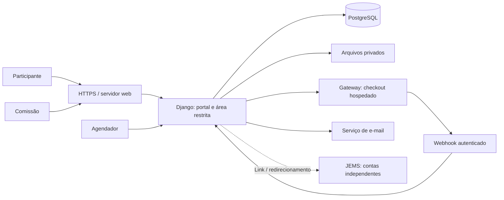
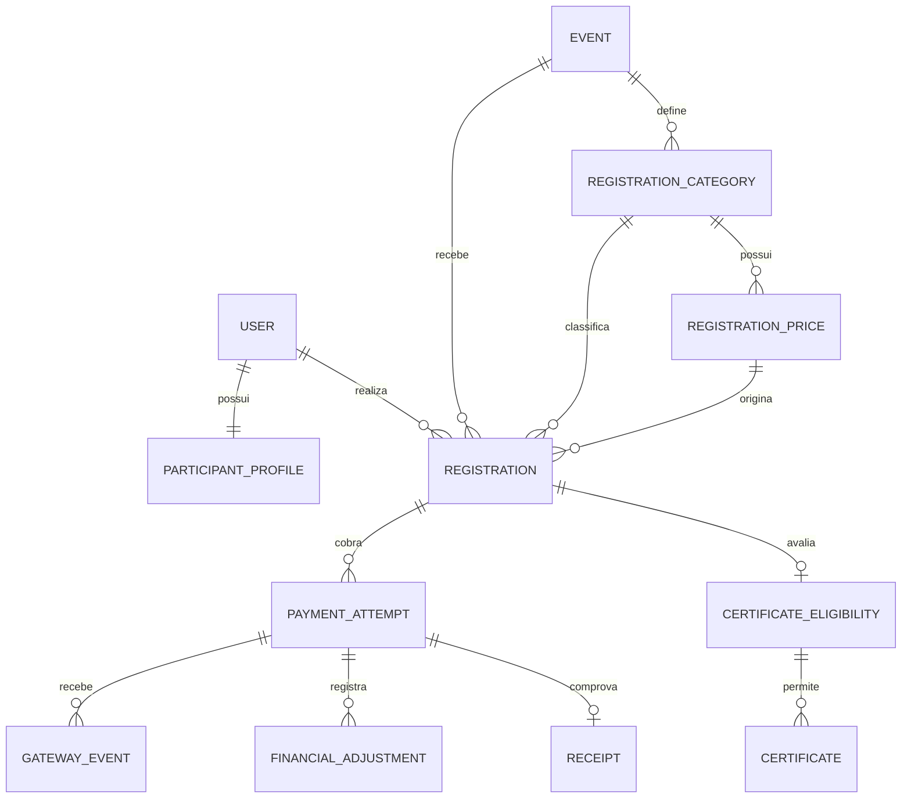

# Backend CHAGS 14 — arquitetura e plano de implementação

Status: fundação Django/PostgreSQL, contas/perfis e inscrições/gestão implementados no desenvolvimento. Pagamentos, certificados e implantação estão pendentes. Veja [configuração e comandos](../backend/README.md).

Referências: proposta `PROPOSTA_COMERCIAL_CHAGS14_ATUALIZADA.docx` e telas do checkout. A proposta define as entregas; as escolhas técnicas abaixo são recomendações para realizá-las. Valores e regras exibidos nas telas não equivalem a regras comerciais aprovadas.

## 1. Escopo e decisões iniciais

O sistema terá cadastro/login, perfil, inscrições, integração de pagamento, recibos, administração, exportações e certificados. O JEMS gerencia artigos, avaliação e autenticação próprios: aqui haverá apenas acesso por link configurado. Não haverá armazenamento de artigos, avaliação por pares ou login compartilhado com o JEMS.

| Decisão | Proposta técnica | Motivo / condição |
| --- | --- | --- |
| Linguagem | Python 3.12 | Familiaridade do desenvolvedor e runtime disponível no ambiente inicial. |
| Framework | Django 5.2 LTS, no patch atualizado da série na implementação | Autenticação, ORM, migrações, formulários, administração e testes integrados. |
| Banco | PostgreSQL em versão suportada pelo CTIC e pelo Django escolhido | Transações, restrições e controle de concorrência; mesma família de banco nos testes de integração. |
| Organização | Uma aplicação, dividida em módulos Django | Deploy e manutenção proporcionais a um evento. |
| Frontend | HTML/CSS/JS existentes, com templates Django para a área restrita | Reaproveitar o trabalho visual e manter sessões na mesma origem. |
| Autenticação | Sessão Django no servidor e cookie seguro | Atende ao portal web sem necessidade inicial de JWT. |
| Administração | Django Admin com permissões e ações específicas; visão de indicadores dedicada | CRUD inicial rápido, com fluxos financeiros protegidos. |
| Pagamento | Checkout hospedado do gateway e adaptador no backend | Dados de cartão ficam com o provedor. Seleção do gateway pendente. |
| Arquivos | Armazenamento privado de PDFs/documentos com download autorizado | A mídia privada não deve ser publicada pelo servidor de arquivos estáticos. |
| Processamento recorrente | Comandos Django acionados por agendador do CTIC | Reconciliação, notificações e emissão podem usar tarefas persistidas no banco; Redis/Celery não são requisitos iniciais. |

O CTIC ainda não confirmou infraestrutura. Não assumir Docker, PostgreSQL local, acesso root ou disponibilidade de um agendador até receber essas informações. GitHub Pages continua capaz de servir páginas estáticas, mas não executa Django; a integração final precisa de hospedagem para a aplicação. Preferir portal e área restrita sob o mesmo domínio.



## 2. Organização do código

Criar o backend em `backend/`, preservando inicialmente as páginas estáticas na raiz.

```text
backend/
  manage.py
  config/              # settings por ambiente, URLs, WSGI
  accounts/            # usuário, perfil, confirmação e recuperação de conta
  registrations/       # evento, categorias, preços e inscrições
  payments/            # gateway, cobranças, retornos e recibos
  certificates/        # elegibilidade, emissão e download
  operations/          # auditoria, tarefas persistidas, indicadores e exportação
  templates/           # telas dinâmicas baseadas no frontend existente
  static/              # recursos da aplicação; integração visual em etapa própria
  tests/               # testes que atravessam os módulos
docs/
  arquitetura-backend.md
```

Views recebem e validam requisições; serviços executam operações de negócio; models e restrições do banco asseguram integridade. Chamadas ao gateway ficam num adaptador para o provedor escolhido. Operações críticas devem ser explícitas, sem depender de cadeias de signals para movimentar dinheiro ou emitir certificados.

## 3. Modelo de dados

Identificadores públicos de objetos restritos serão UUIDs. Isso não substitui autorização: toda consulta deve verificar dono ou permissão administrativa. Datas com timezone, persistidas em UTC e exibidas conforme o contexto do evento. Valores monetários em `Decimal`, nunca `float`, acompanhados da moeda.

| Entidade | Campos e relações principais | Regras |
| --- | --- | --- |
| `User` | E-mail de login, senha gerenciada pelo Django, nome, ativo, confirmação de e-mail, datas | Modelo customizado desde a primeira migração; e-mail normalizado, unicidade sem distinguir maiúsculas/minúsculas no banco. Não remover regras legítimas como pontos e sufixos `+`. Grupos/permissões Django, sem campo de papel único. |
| `ParticipantProfile` | Um por usuário; país, instituição, idioma preferido e contato se necessário | País em código padronizado; idioma PT/EN/ES. CPF/passaporte não são obrigatórios gerais; exigir somente o que o gateway e a operação justificarem. |
| `AccountActionToken` | Usuário, propósito, hash do código, e-mail e hash de autenticação de origem, expiração/uso/revogação | Confirmação e recuperação separadas, uso único sob bloqueio e invalidação ao mudar senha/e-mail. |
| `AccountEmail` | Token, código temporário para envio, estado, tentativas, disponibilidade e reserva | Fila transacional implementada para as contas; não registra valores de senha. Código apagado após envio/cancelamento/falha final. |
| `AuthThrottleBucket` | Chave HMAC, início da janela e contador | Limites de tentativa compartilhados no PostgreSQL, sem IP/e-mail em claro no bucket. |
| `Event` | Código, título, datas, timezone, janela de inscrições, URL JEMS | Um evento inicial CHAGS 14, 12–16/07/2027; janelas ainda não definidas. Não generalizar para uma plataforma de múltiplos eventos. |
| `RegistrationCategory` | Evento, código, nomes traduzidos, ativa, exige comprovação | Não excluir categorias já utilizadas; desativar. Critérios dependem da organização. |
| `RegistrationPrice` | Categoria, valor, moeda, início/fim de validade, ativo | Valor não negativo; períodos válidos e não sobrepostos entre preços ativos para a mesma categoria/moeda. Novos valores são novos registros; fim/ativação podem mudar sem alterar snapshots. |
| `Registration` | Usuário, evento, categoria, preço de origem, valor/moeda e descrição copiados, estado, revisão de categoria, datas | Uma inscrição por usuário/evento. Preço congelado na criação; mudar tabela não altera inscrição existente. Mudança de categoria/preço exige operação explícita antes de qualquer cobrança ativa ou paga. |
| `PaymentAttempt` | Inscrição, provedor, chave de idempotência, ID da cobrança, estado, valor/moeda, referência local, expiração e URL de checkout quando disponível | Várias tentativas históricas, no máximo uma ativa por inscrição. Chaves únicas; ID externo único por provedor quando existente. Valor/moeda iguais ao preço congelado. |
| `GatewayEvent` | Provedor, ID do evento ou chave equivalente documentada, cobrança, tipo, estado de processamento, timestamps, erro sanitizado | Unicidade por provedor/chave. Guardar somente dados necessários; não registrar cartão, tokens ou payload bruto sem política explícita. |
| `FinancialAdjustment` | Cobrança, ID externo do ajuste, tipo, valor/moeda, data | Registra reembolso/estorno/disputa confirmados. Unicidade externa; não inventa dinheiro recebido nem permite editar livremente uma cobrança paga. |
| `Receipt` | Cobrança paga, número único, data, dados necessários congelados, estado | Um recibo por cobrança efetivamente paga. Recibo de pagamento não é nota fiscal. Reembolso não apaga o histórico. |
| `CertificateEligibility` | Inscrição, elegível, critério/versão, justificativa, responsável e data | Pagamento sozinho não comprova participação. Critérios e responsável definidos pela organização. |
| `Certificate` | Elegibilidade, tipo, versão, nome/título/carga horária congelados quando aplicáveis, arquivo privado, estado, datas | Uma versão vigente por inscrição/tipo. Reemissão cria versão e preserva anterior; não fabricar carga horária ou assinatura. |
| `AuditEntry` | Ator humano/sistema, ação, objeto, campos alterados necessários, motivo e data | Registrar ações administrativas e financeiras; consulta restrita e sem edição comum no admin. Não guardar senhas, segredos ou excesso de dados pessoais. |
| `DeliveryJob` | Tipo, referência, chave única, estado, tentativas, próxima execução, reserva temporária, erro sanitizado | Criado na mesma transação da operação que exige notificação/arquivo. Execução idempotente, com retomada de reservas expiradas. |

Caso a organização aprove documentos de comprovação, acrescentar `CategoryEvidence` vinculado à inscrição: arquivo privado, validade da revisão e revisor. Aprovar esse fluxo antes de coletar documentos potencialmente sensíveis. Isenções, descontos e transferências manuais dependem de confirmação; não criar cobranças fictícias de valor zero.

Relações principais:



## 4. Inscrição, pagamento e certificado são estados distintos

### Inscrição

| Estado | Significado / transição permitida |
| --- | --- |
| `pending` | Inscrição criada, aguardando requisitos. Pode ir para `confirmed` ou `cancelled`. |
| `confirmed` | Revisão de categoria concluída quando exigida e pagamento válido reconhecido, ou isenção formal aprovada se esse fluxo for contratado. Pode ir para `cancelled`. |
| `cancelled` | Cancelamento registrado com motivo/ator. Não implica reembolso e não pode ser revertido por webhook. Reabertura, se aprovada pela comissão, é operação própria e auditada. |

Revisão da categoria é um campo separado: `not_required`, `pending`, `approved`, `rejected`. A conta não se torna inativa por uma inscrição ser cancelada.

Pagamento recebido para inscrição cancelada fica registrado para tratamento financeiro, sem confirmar novamente a participação. Reembolso integral ou disputa retira a condição financeira regular, bloqueia novas emissões automáticas e gera revisão administrativa; a decisão de cancelar participação ou revogar certificado depende da política aprovada.

### Tentativa de pagamento

| Estado | Significado / regra |
| --- | --- |
| `creating` | Reserva local persistida antes da chamada ao gateway. Pode ir para `pending` ou diretamente para `paid` após confirmação, ou para uma falha definitiva verificada. Não abrir outra tentativa enquanto a criação estiver incerta. |
| `pending` | Cobrança existe e aguarda pagamento. Pode ir para `paid`, `failed`, `expired` ou `cancelled`, conforme o provedor. |
| `paid` | Recebimento confirmado pelo provedor e conciliado. Retornos antigos de pendência/falha não o rebaixam. Ajustes financeiros são registrados separadamente. |
| `failed` | Falha definitiva confirmada. Timeout de rede, sozinho, não estabelece este estado. |
| `expired` | Expiração confirmada de acordo com o provedor. Pagamento tardio confirmado deve ser conciliado, sem ignorar o valor recebido. |
| `cancelled` | Cancelamento da cobrança confirmado pelo provedor, distinto de cancelar a inscrição. Recebimento tardio confirmado vai para revisão/conciliação. |

Não pressupor a ordem dos eventos recebidos. Eventos contraditórios ou tardios exigem consulta ao gateway segundo sua API. Um mesmo recebimento não gera dois recibos ou duas confirmações. Se houver duas cobranças pagas para a mesma inscrição, registrar ambas, sinalizar duplicidade e impedir emissão de novas cobranças; a devolução depende de uma política e de operação autorizada.

O estado financeiro exibido será derivado das cobranças e ajustes: sem pagamento, pendente, pago, parcialmente reembolsado, reembolsado ou em disputa. Disputas não serão tratadas como simples regressão de `paid` para `pending`.

### Certificado

Elegibilidade começa não aprovada. Após decisão autorizada, a geração produz uma versão em processamento, disponível ou com falha recuperável. Arquivo só é liberado depois de gravado integralmente. Revogação exige motivo e preserva o histórico. Repetir geração da mesma versão não cria certificados duplicados. Validação pública por código fica como decisão opcional: se adotada, deve divulgar apenas dados aprovados pela organização.

## 5. Fluxo de cobrança e confiabilidade

1. O participante autenticado envia POST de criação de cobrança, com CSRF. O servidor valida titularidade, inscrição, janela, categoria e preço. O navegador nunca define o valor.
2. Em transação curta e com bloqueio da inscrição, reutilizar tentativa ativa ou criar uma reserva `creating` com chave idempotente. Restrições do banco protegem requisições simultâneas.
3. Após commit, chamar o gateway com a chave e referência local. Não manter transação/bloqueio do banco durante a chamada de rede. Persistir o resultado em nova transação, respeitando mudanças já feitas pelo webhook: uma resposta de criação pendente não pode sobrescrever um pagamento confirmado.
4. Se houver timeout ou interrupção, reconciliar pela chave/referência antes de repetir ou criar nova cobrança. Só escolher gateway que ofereça mecanismo confiável para esse caso.
5. O retorno do checkout mostra que a confirmação está sendo verificada. Redirecionamento do navegador, captura de tela e parâmetros de URL não confirmam pagamento.
6. O webhook usa a verificação oficial do provedor: assinatura/segredo e proteção contra replay quando suportada; consultar API autenticada se exigido pelo contrato. Validar cobrança, recebedor, ambiente teste/produção, moeda e valor. Só a rota de webhook pode dispensar CSRF, mantendo autenticação do provedor.
7. Persistir evento autenticado antes de reconhecê-lo. Evento duplicado já persistido pode receber sucesso. Falha na persistência deve provocar retry. Payload inválido/assinatura inválida é rejeitado. Se o provedor não tiver assinatura, implementar a alternativa oficial de autenticação e confirmação; nunca aceitar notificação arbitrária.
8. Processar com bloqueio e idempotência. Webhook pode chegar antes de salvar o ID externo: correlacionar pela referência local e reconciliar. Desconhecidos ficam para investigação sem alterar inscrições.
9. Ao reconhecer pagamento, gerar recibo e atualização da inscrição na mesma transação, conforme os requisitos. Agendar notificações de forma durável; falha no envio de e-mail não desfaz pagamento.
10. Um comando periódico recupera eventos/tarefas pendentes e cobranças incertas. Frequência, timeout e retenção serão definidos com o gateway e o CTIC. O contrato final de webhook depende da documentação do provedor escolhido.

## 6. Acesso e administração

Grupos Django permitem acumular funções; concessão de permissões é restrita à gestão autorizada. `is_staff` autoriza acesso ao admin, mas não concede por si só acesso a todos os dados. Restringir querysets, URLs, ações e downloads no servidor, não somente esconder botões.

| Função | Pode fazer | Limites |
| --- | --- | --- |
| Visitante | Consultar portal, cadastrar conta, iniciar recuperação de senha | Sem listagens ou dados pessoais de participantes. |
| Participante | Perfil próprio, inscrição própria, cobranças, recibos/certificados próprios, acesso ao JEMS | Não escolhe permissões nem altera valores, estados financeiros ou elegibilidade. |
| Atendimento / inscrições | Consultar dados necessários, revisar categoria e corrigir dados autorizados, cancelar inscrição com motivo | Sem marcar cobrança como paga, alterar permissões ou ler todos os dados financeiros. |
| Financeiro | Consultar cobranças, conciliação, recibos e exportação financeira autorizada | Sem editar arbitrariamente `paid`; ação de reembolso automático só será exposta após definição da política. |
| Certificados | Registrar elegibilidade, emitir, reemitir ou revogar com motivo | Sem presumir presença pelo pagamento ou alterar cobranças. |
| Gestão | Indicadores e administração operacional aprovada, concessão controlada de grupos | Ações sensíveis auditadas; dados financeiros continuam sujeitos às regras de integridade. |
| Superusuário técnico | Manutenção excepcional | Conta fora da rotina da comissão; nenhuma credencial padrão em produção. |

No Django Admin, campos financeiros, snapshots e histórico ficam somente leitura; alterações de negócio usam ações/serviços com permissão, validação e motivo. Exportações selecionam somente colunas necessárias, respeitam acesso e neutralizam fórmulas em células CSV, inclusive conteúdo iniciado por `=`, `+`, `-`, `@` ou controles relevantes.

## 7. Rotas e integração visual planejadas

Rotas iniciais em mesma origem, com templates e formulários Django. Não criar uma API pública completa sem necessidade; endpoints JSON serão adicionados apenas para interações que a interface exigir.

| Rota proposta | Operação |
| --- | --- |
| `/conta/cadastro/`, `/conta/entrar/` | GET do formulário e POST de cadastro/login. |
| `/conta/sair/` | POST com CSRF; não usar link GET que encerra sessão. |
| `/conta/confirmar-email/` | Link com código no fragmento, confirmação por POST com uso único/expiração; não confirma pagamento. |
| `/conta/recuperar-senha/`, `/conta/redefinir-senha/` | Respostas genéricas e redefinição por POST; código no fragmento do link e fora dos logs de URL. |
| `/participante/`, `/participante/perfil/` | Dashboard e edição de perfil próprios. |
| `/participante/inscricao/` | Consulta e POST para inscrição única; sempre calcular preço no servidor. |
| `/participante/inscricao/pagar/` | POST idempotente para obter/reutilizar checkout. |
| `/participante/pagamentos/<uuid>/` | Estado da própria cobrança; nenhum parâmetro confirma pagamento. |
| `/participante/recibos/<uuid>/`, `/participante/certificados/<uuid>/` | Downloads privados autorizados. |
| `/participante/jems/` | Acesso à URL HTTPS configurada, sem credenciais ou redirecionamento arbitrário enviado pelo usuário. |
| `/integracoes/pagamentos/<provedor>/webhook/` | Recepção autenticada conforme contrato do gateway. |
| `/gestao/`, `/gestao/indicadores/`, `/gestao/exportacoes/` | Admin, indicadores e exportações conforme permissões. Exportação financeira separada da cadastral. |

O HTML original `pt-br/sistema-login.html` continua preservado. Quando servido pelo Django, essa rota redireciona ao login implementado com POST, campos nomeados, CSRF e validação. A versão independente no GitHub Pages continua estática e não executa esses fluxos. Não transmitir senha pela URL.

`pt-br/sistema-submissao.html` é um protótipo preservado; sua rota Django redireciona ao dashboard protegido, sem upload de artigos. Acesso ao JEMS está implementado por link HTTPS configurável no evento, sem autenticação compartilhada. As telas de conta/perfil/inscrição e os e-mails transacionais estão em PT/EN/ES, com preferência salva no perfil e idioma congelado por mensagem. ES ainda não está presente no portal e FR aparece nas telas, embora a proposta cite PT/EN/ES; alinhar com o frontend.

## 8. Segurança e operação

- Usar hash/validadores de senha, sessões e recuperação do Django. Definir modelo customizado de usuário antes da primeira migração; conferir unicidade por e-mail no banco.
- Restringir tentativas de login/cadastro/recuperação no servidor; selecionar mecanismo compatível com o deploy. Confirmação de e-mail deve ocorrer antes de iniciar pagamento. Recuperação precisa de entrega real de e-mail em produção.
- Desenvolvimento grava e-mails em arquivos privados, sem envio externo. Produção exige SMTP com TLS verificado, origem canônica HTTPS e worker de entrega; filas e sessões precisam permanecer privadas. MFA para equipe administrativa continua pendente antes da liberação pública.
- `DEBUG=False`, hosts explícitos, HTTPS e cookies `Secure`/`HttpOnly`/`SameSite` apropriados em produção. Configurar proxy confiável segundo a topologia do CTIC, sem confiar cegamente em headers do cliente.
- Validar permissões de objeto e CSRF em operações da sessão. Escapar conteúdo em templates e limitar redirects. Logs e auditoria não incluem senhas, tokens de reset, segredos de gateway ou dados completos de cartão.
- Dados pessoais mínimos, acesso restrito, política de retenção e responsáveis definidos com a organização. Backups do PostgreSQL e de arquivos privados com restauração ensaiada; não apagar histórico financeiro por simples exclusão de perfil.
- Arquivos de comprovação, se aprovados: tamanho/formato/conteúdo validados, nomes internos gerados, acesso privado e nunca executáveis. PDFs de certificados/recibos vêm de templates internos, sem HTML arbitrário ou busca livre de URLs externas.
- Ambiente de teste do gateway separado da produção, com credenciais e eventos diferenciados. Nenhuma cobrança real para validar desenvolvimento.
- Deploy WSGI por servidor apropriado atrás de proxy HTTPS; `runserver` somente em desenvolvimento. Arquivos estáticos podem ser públicos; banco e arquivos privados não.

## 9. Decisões pendentes e o que elas bloqueiam

| Informação | Evidência atual | Impacto |
| --- | --- | --- |
| CTIC: Python, PostgreSQL, proxy HTTPS, disco privado, processos e agendador | Usuário acredita que há suporte, sem especificação técnica | Bloqueia fechar o deploy, não bloqueia desenvolver o núcleo. |
| Gateway e recebedor da organização | Organização abrirá conta bancária no Brasil; titular/provedor não definidos | Bloqueia adaptador real, contrato de webhook e testes integrados de pagamento. Veja [comparação inicial](escolha-pagamentos.md). |
| Cartão estrangeiro, moeda, PIX e wire transfer | Proposta delega meios ao provedor; telas anunciam transferência internacional | Confirmar suporte e regras. Não implementar fluxo manual internacional por suposição. |
| Categorias, preço, lotes, janelas, comprovação, isenção | Telas mostram R$ 300/200/100/100/75 e hipóteses de isenção | Bloqueia configuração comercial de produção. Dados de teste podem ser claramente fictícios. |
| Cancelamento, reembolso, pagamento duplicado ou tardio | Sem política na proposta | Registrar e conciliar desde o início; automação de devolução depende da política. |
| Certificados: tipo, presença, nome, carga horária, assinatura, data de liberação | Proposta remete à organização | Bloqueia template e liberação reais. Elegibilidade manual auditada é desenho inicial, sujeito à definição. |
| E-mail transacional, domínio e URL do JEMS | Sem configuração operacional fornecida | Bloqueia entrega externa e publicação, não testes locais. |
| Privacidade, retenção e acesso da comissão | Sem política fornecida | Bloqueia iniciar operação com dados reais. |

Com o núcleo, usar fixtures sintéticas e e-mail local. Não adotar os preços do HTML como tabela aprovada, criar credenciais fictícias de terceiros nem fazer isenção depender da inferência de identidade do participante.

## 10. Implementação e critérios de aceite

| Etapa | Entrega | Verificação necessária | Esforço sugerido |
| --- | --- | --- | --- |
| 1. Fundação | Projeto Django, settings, dependências fixadas, PostgreSQL de desenvolvimento, usuário customizado, migrações e organização dos módulos | Instalação reproduzível, `check`, migrações num banco vazio, inicialização HTTP e testes no PostgreSQL. | Alto para decisões/migrações; médio para estrutura. |
| 2. Conta e perfil | Cadastro, e-mail de confirmação, login/logout, recuperação, perfil e grupos | Duplicidade de e-mail inclusive concorrente, senha não exposta, token expirado/reutilizado, CSRF, limites de tentativas e negação de acesso ao perfil alheio. | Alto no desenho e revisão; médio nas telas/validações. |
| 3. Inscrições e gestão | Categorias/preços, inscrição única, revisão quando aplicável, admin, indicadores e CSV | Preço decidido no servidor e congelado, unicidade concorrente, restrições por função, cancelamento auditado, exportação sem fórmula injetada. | Médio; alto na concorrência/permissões. |
| 4. Pagamentos | Adaptador, checkout, webhook, reconciliação, recibos e integração sandbox | Assinatura inválida, evento repetido/fora de ordem, valor/moeda/recebedor incorretos, pagamento de outra pessoa, timeout após criação, callback antes da persistência, cobranças simultâneas, recebimento tardio/duplicado e ajustes. Pelo menos um fluxo real de sandbox do provedor. | Alto. |
| 5. Certificados | Elegibilidade, template aprovado, PDF privado, reemissão/revogação | Sem emissão por pagamento isolado, sem download alheio, geração idempotente e dados históricos preservados. | Médio; alto na revisão de regras. |
| 6. Operação | Integração visual PT/EN/ES, testes completos e deploy CTIC | Fluxo de participante e comissão no navegador, testes integrados, `check --deploy` com settings reais, HTTPS, envio de e-mail, reinício de tarefas/serviços e restauração de backup. | Alto na revisão final; médio em ajustes. |

Testar comportamento e falhas relevantes, não apenas existência de endpoints. PostgreSQL é necessário para validar locks/restrições; testes só em SQLite não comprovam concorrência. Mocks permitem desenvolver antes da escolha do gateway, mas não substituem sua validação em sandbox. Pagamento, permissões e retomada após falha precisam de testes automatizados desde suas respectivas etapas.

Fundação implementada: Django 5.2.17, Python 3.12, psycopg 3.3.6, PostgreSQL local 17.11, usuário customizado, migrações, admin técnico e endpoints de saúde. Dependências fixadas com hashes; instruções em `backend/README.md`. Contas e grupos no admin ficam restritos ao superusuário técnico para evitar concessão indireta de privilégios.

Conta/perfil implementados: cadastro com resposta genérica, confirmação por POST, login/logout do participante, recuperação, perfil, limites compartilhados de tentativas e fila de e-mail com retomada. Validação: 57 testes no PostgreSQL e fluxo completo por HTTP com e-mails locais. Produção SMTP/CTIC, MFA administrativo e revisão visual permanecem pendentes; as telas do participante e e-mails agora estão traduzidos em PT/EN/ES.

Inscrições/gestão implementadas: evento fechado por padrão, categorias/preços configuráveis, janela explícita, inscrição única com snapshot imutável, revisão/cancelamento com motivo e auditoria transacional, admin de consulta, busca/paginação, indicadores e CSV. Comandos criam metadados do evento e grupos sem usuários/valores comerciais. Permissões distintas para atendimento, indicadores e exportação; configuração comercial continua técnica. PostgreSQL garante unicidade, janelas, valores e moedas válidos, sobreposição por exclusão GiST/`btree_gist` e proteção de histórico por triggers. Revisão/valor zero não confirmam inscrição. Aprovação/rejeição de categoria pode ser revista enquanto pendente, sempre com motivo; canceladas não reabrem. Dados reais, uploads de comprovação e políticas comerciais continuam dependendo da organização.

Validação acumulada: 98 testes passaram no PostgreSQL, incluindo concorrência em inscrição/preços/cancelamento, restrições do banco e permissões; o fluxo de inscrição/gestão/exportação também passou por HTTP real com CSRF. Auditoria indisponível desfaz criação/cancelamento e impede entrega do CSV. Dados fictícios removidos e configuração fechada do evento restaurada. Setup repetido, migrações e coleta de estáticos conferidos. Auditoria é somente leitura nas interfaces da aplicação; a credencial técnica de banco continua capaz de escrever, exigindo proteção operacional/backups.

Próximo passo concreto: escolher o gateway conforme os requisitos da organização e implementar pagamentos, checkout, webhook autenticado, conciliação e recibos. O provedor, recebedor, moedas/métodos, credenciais sandbox e regras de reembolso/isenção ainda precisam ser definidos. Não inferir essas decisões a partir dos preços ou formas de pagamento no HTML. O link ao JEMS é configurável e HTTPS, com autenticação independente; não implementamos gestão de artigos.

Internacionalização implementada: gettext Django nas telas/mensagens PT/EN/ES, seletor protegido por POST/CSRF, cookie para visitante e preferência persistida para participante autenticado. Novas inscrições congelam os nomes das categorias nos três idiomas; dados históricos sem tradução usam português. E-mails preservam o idioma da fila, independente do worker e de alterações posteriores. 17 testes específicos validam seleção, mensagens, autorização, snapshots e valores; suíte acumulada de 115 testes. Tradução integral do portal estático/gestão, revisão visual e idiomas do futuro checkout/JEMS continuam pendentes.
